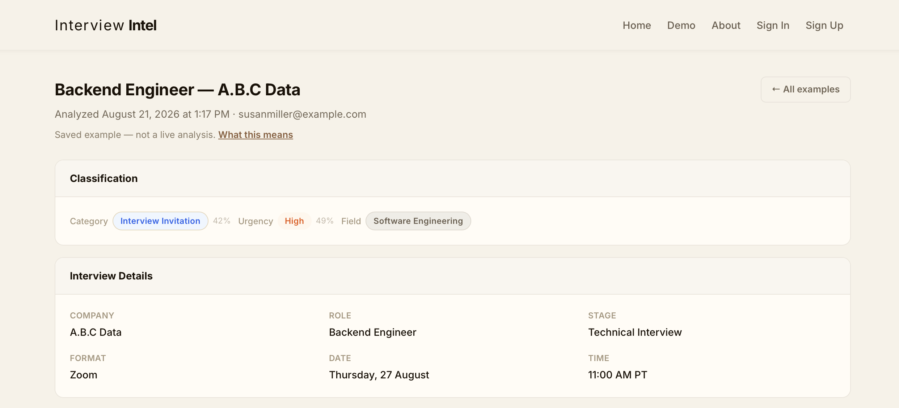
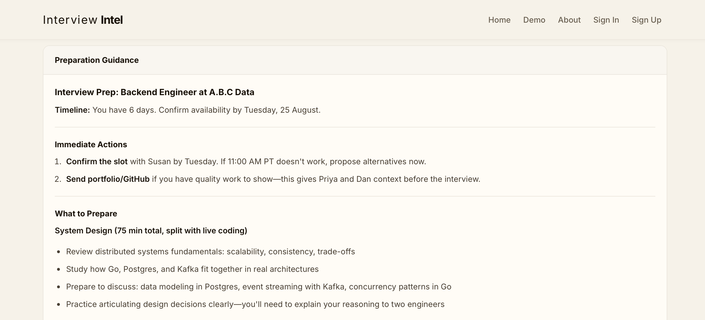
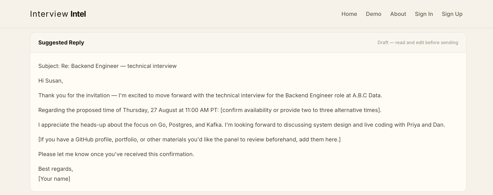
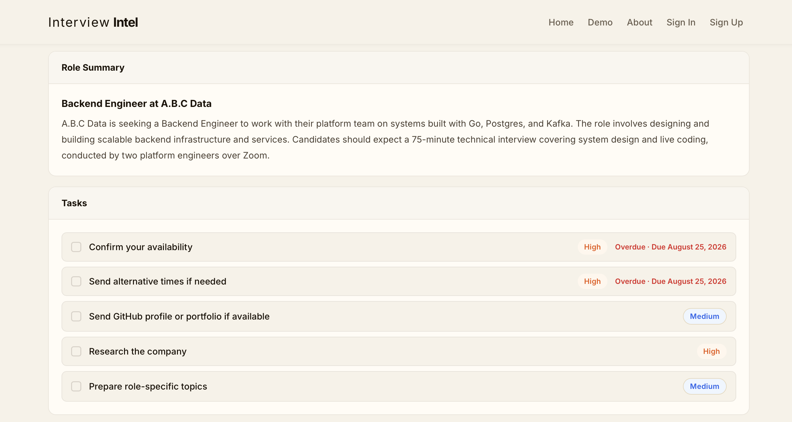

# Interview Intel

Paste an interview email, get back the details that matter: who's asking, for what role, when,
and what you need to do about it. It classifies the email, extracts the interview details,
writes preparation guidance appropriate to where you are in the process, drafts a reply, and
turns stated deadlines into dated tasks.

A portfolio project. I also use it for my own job search.



---

## What it does

You paste an email. The request returns immediately and a background worker does the rest:

1. A scikit-learn classifier reads the **category** (interview invitation, scheduling,
   rejection, offer, recruiter outreach, follow-up, application received), the **urgency**, and
   the **job field**.
2. An LLM extracts company, role, stage, format, dates and times — plus any actions the email
   explicitly asks you to take.
3. Five further LLM calls generate preparation guidance, questions to ask, a draft reply and
   summaries — but only the ones that make sense. A rejection doesn't get an interview prep
   guide.
4. Stated deadlines become tasks with due dates. "Confirm by 18 August" is a dated task;
   "before the call" keeps the wording and gets no date, because the app doesn't know when the
   email was sent.

The page polls until the analysis lands, then reloads.



The draft reply restates the options the email gave and leaves the choice to you — it never
confirms a time on your behalf:





---

## Running it

You need Docker with Compose v2. Nothing else — Python, Postgres and Redis all run in
containers. The image is about 720 MB and the first build pulls the whole
NumPy/SciPy/scikit-learn stack, so expect it to take a few minutes.

```bash
git clone https://github.com/IlkerBaran/interview-intel.git
cd interview-intel

cp .env.docker.example .env.docker    # then edit it — see below
docker compose --env-file .env.docker build
docker compose --env-file .env.docker up -d db redis
docker compose --env-file .env.docker up migrate
docker compose --env-file .env.docker up -d
```

Then open http://localhost:8000. `migrate` should exit 0, and
`docker compose --env-file .env.docker ps` should show `web` as healthy.

Pass `--env-file .env.docker` on every Compose command. Without it, `POSTGRES_PASSWORD` is
unset and Compose fails immediately with a message that doesn't obviously point at the missing
flag.

### Filling in .env.docker

Generate `SECRET_KEY` and `WTF_CSRF_SECRET_KEY`:

```bash
python -c "import secrets; print(secrets.token_urlsafe(48))"
```

**`POSTGRES_PASSWORD` and the password inside `DATABASE_URL` have to match.** They're separate
lines and nothing checks one against the other — a mismatch shows up as an authentication
error when `migrate` runs, which doesn't obviously point back here.

The trained models are committed, so there's nothing to train: `ml/models/*.pkl` is in the repo
and ships in the image. See [`ml/models/README.md`](ml/models/README.md) if you want to
retrain them.

The API keys are the part that actually gates things — see below.

### What works without API keys

`.env.docker.example` ships placeholders for `ANTHROPIC_API_KEY` and `RESEND_API_KEY`. The
stack starts fine with them, because only their presence is checked, not their validity. What
you can actually do:

| | With placeholder keys |
|---|---|
| **`/demo`** | Works. Three saved analyses replayed through the real message UI — no login, no LLM call, no ML call. |
| **Registration** | Works, but the verification email fails (`ResendError: API key is invalid`) and login is refused at `/auth/unverified`. Get past it with `flask verify-user` below. |
| **Analysis** | Fails, and says so. The message ends FAILED, the page says the analysis service isn't available, and the quota slot is refunded. |

**[http://localhost:8000/demo](http://localhost:8000/demo) is the zero-config path.** Clone,
start, open it — that's the whole output format without an account or a key. If you're
evaluating this and only want to look at one thing, look at that.

An [Anthropic](https://console.anthropic.com/) key is what makes real analysis work.
[Resend](https://resend.com/) is only needed for verification email, and `flask verify-user`
covers that locally.

That third row used to read differently: a bad Anthropic key produced an analysis marked
*completed* with every LLM field empty — an ML-only classification and nothing else, which
looks like a broken product rather than a missing key. 401 and 403 are now treated as
configuration failures rather than per-message ones, so the analysis fails honestly and the
worker log says `check ANTHROPIC_API_KEY`. Message-specific 400 and 422 still degrade to the
ML-only result, which is the right answer for one odd email.

### Getting past email verification locally

Registration sends a verification email, and without a working Resend key it never arrives:

```bash
docker compose --env-file .env.docker exec web \
    flask verify-user you@example.com --force
```

`--force` is needed because `.env.docker` sets `FLASK_ENV=production` — the Compose stack is
production-shaped even on a laptop. The command refuses to run under that flag otherwise,
because it skips the proof of email ownership the emailed token provides. It's a local
evaluation aid, not a second verification path.

### Tearing it down

```bash
docker compose --env-file .env.docker down -v
```

`-v` drops the Postgres volume too, so the next start is a clean database. Leave it off to keep
your data.

Running without Docker is possible but needs five processes (Flask, two Celery workers, Beat,
Redis) plus Postgres or SQLite. The compose file is the shortest path.

---

## Architecture

Four application roles from one image, differing only by command and environment
configuration:

| Role | Runs |
|---|---|
| `web` | Gunicorn, no ML models loaded |
| `worker-ml` | Celery on the `ml` queue, models loaded |
| `worker-email` | Celery on the default queue, plus Beat |
| `migrate` | One-shot `flask db upgrade` |

The web process doesn't load the models at all — no route reaches inference, since analysis
runs on the `ml` queue. That saves 113 MB per worker, which turned out to be the cost of the
scikit-learn → scipy → pandas import chain rather than the 1.4 MB of pickles.

Analysis was originally done in threads. Moving it to Celery took three stages, one commit
each, with the hard part being terminal-state guarantees: every analysis reaches a terminal
state, including when the broker is down, the worker is killed mid-task, retries are
exhausted, or the machine dies. A periodic reaper sweeps anything still pending past a
threshold, because nothing inside a task can fix a task that isn't running.

---

## The decisions

There are seventeen architecture decision records in [`docs/adr/`](docs/adr/). They're the
most interesting thing here — each one records what was chosen, what was rejected, and where
the guarantee stops.

A few worth reading:

- [Staged migration from threads to Celery](docs/adr/0002-use-celery-and-redis-for-background-jobs.md) — why three stages rather than one, and
  what "every path reaches a terminal state" actually required
- [Rate limiting](docs/adr/0012-Rate-Limiting-IP-Keying-Fail-Open-Storage-and-Proxy-Trust.md) — why the auth routes key on IP rather than the submitted email
  address, and how keying on the address would have turned the limiter into an
  account-existence oracle
- [Terminal-state guarantees](docs/adr/0011-analysis-task-reliability-and-terminal-state.md) — every failure path,
  including the ones no running code can reach
- [The analysis quota](docs/adr/0013-per-user-lifetime-analysis-quota.md) — consuming a slot in the same transaction as the insert,
  refunding on every failure path, and why one of those paths is capped
- [The classifier retrain](docs/adr/0014-classifier-retrain-and-label-redesign.md) — see below
- [One image, four container roles](docs/adr/0016-one-application-image-four-container-roles.md) — measured memory, and why the Celery health
  check was left out

---

## Where it falls short

**The classifier is the weak part, and I know why.** It's trained on synthetic email generated
from templates. On held-out synthetic data it scores well; on real recruiting email it does
noticeably worse, because a third of a real email used to be vocabulary the model had never
seen.

The retrain fixed most of that — out-of-vocabulary rate on real email went from 30% to 7.4%,
and the field classifier now gets all four of my test emails right where it previously got
none. But the evaluation set is four emails I labelled by hand, which is not an evaluation
set. The honest position is that the synthetic scores don't predict real-world accuracy, and
the ADR says so at length.

What the app does about it: the field badge shows "Unclassified" rather than guessing, and no
percentage is shown for it, because the underlying number is a softmax over uncalibrated
margins and was never a probability.

**Other limits**, all documented:

- Relative deadlines ("by end of week", "next Tuesday") are refused rather than parsed. The app
  knows when you pasted the email, not when it was sent, so anchoring them would produce a
  wrong date exactly when you're behind on your inbox.
- Analysis never creates applications. It links to ones you entered by hand, because persisted
  records shouldn't be built from model output.
- A missed action is an invisible failure — three generic tasks look the same whether the email
  asked for nothing or extraction missed something.

---

## Built with

Python 3.14.3, Flask, Celery, Redis, PostgreSQL, SQLAlchemy, scikit-learn, the Anthropic API,
Docker.

Rate limiting via Flask-Limiter, security headers via Flask-Talisman with a
`script-src 'self'` policy and no inline JavaScript anywhere.

---

## Author

**Ilker Baran** — backend engineer, Python / Flask / Celery / ML.

[GitHub](https://github.com/IlkerBaran) · [LinkedIn](https://www.linkedin.com/in/ilkerbaran)
